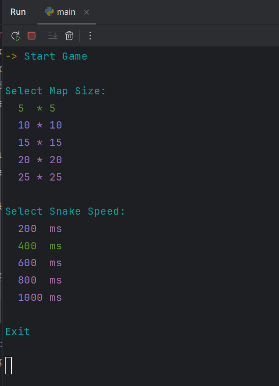
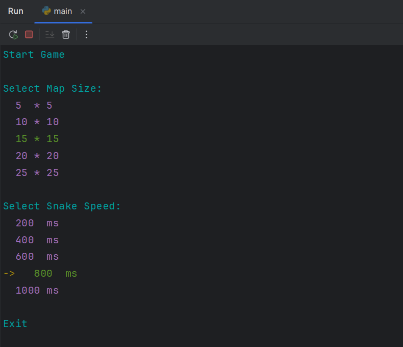
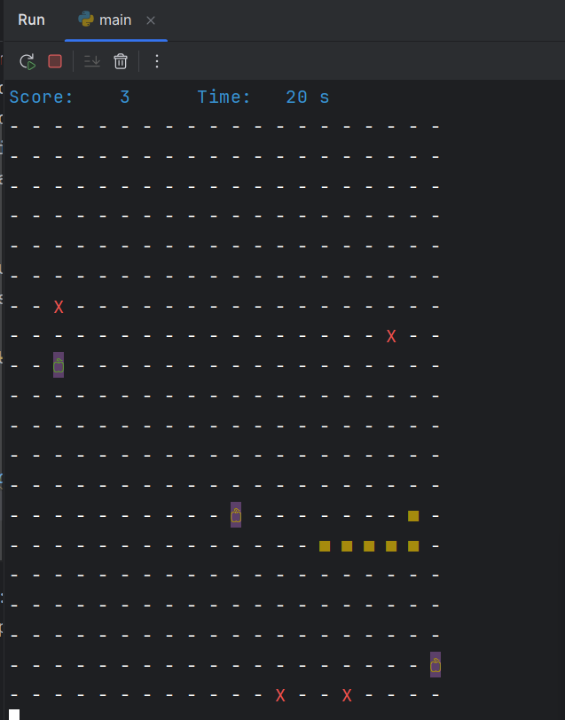

# Snake Game - Terminal Edition 🐍

## Overview
This project is a simple yet interactive Snake game built to run in the terminal, using Python with the `colorama` package for colored text output. The game features:
- A dynamic GUI-like menu interface.
- Smooth snake movement within a customizable map size.
- Adjustable snake speed for varying difficulty levels.
- Interactive gameplay with keyboard controls.

## Features
- **Terminal-Based Interface**: Runs entirely within the terminal using text-based graphics.
- **Customizable Settings**: Users can select the map size and snake speed before starting the game.
- **Smooth Gameplay**: Implements a game engine to handle rendering and controls efficiently.
- **Periodic Tasks & Controls**: Uses event-driven logic to update gameplay mechanics.
- **Object-Oriented Design**: The game structure follows OOP principles for modularity.

## Control
1. Navigate the menu using:
   - **Arrow Keys** (`Up`/`Down`): Move between menu options.
   - **Enter/Space**: Select an option.
   - **Escape**: Exit the game.

2. After selecting your preferred settings, the game will start.

3. Control the snake with:
   - `W` → Move Up
   - `S` → Move Down
   - `A` → Move Left
   - `D` → Move Right

## ScreenShots

## Code Structure
- `engine.py`: Core game engine handling rendering and task execution.
- `utilities.py`: Helper functions and position management.
- `game_screen.py`: Handles game logic.
- `gui_screen.py`: Implements the interactive menu.
- `buttons.py`: Manages button interactions.